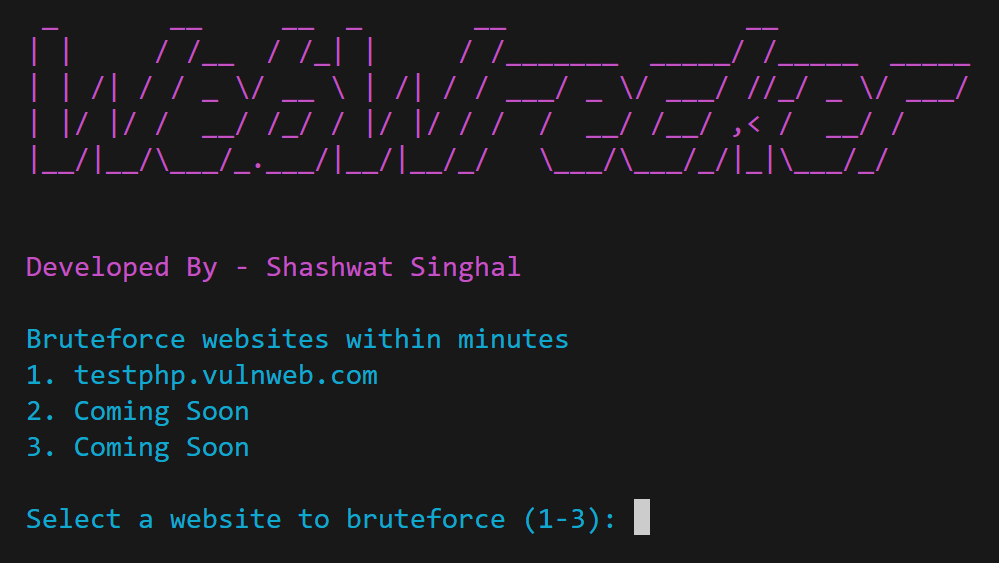
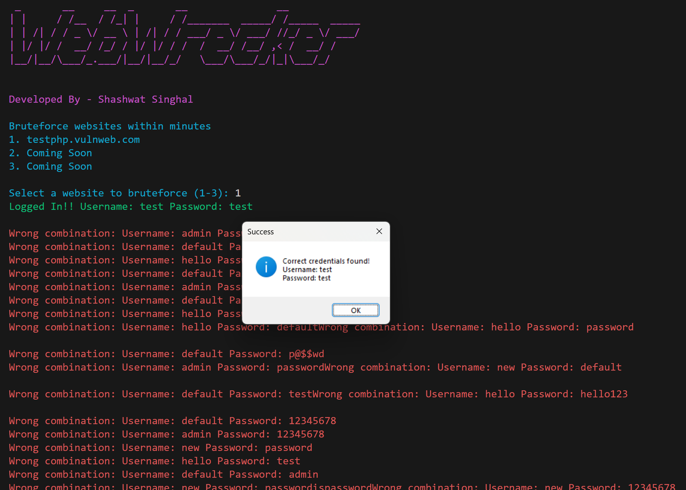

# WebWrecker



## Developed By: Shashwat Singhal

## Overview

WebWrecker is an advanced and user-friendly brute-force tool designed to test login on websites. Developed by Shashwat Singhal, this tool is ideal for penetration testers, security researchers, and anyone interested in exploring web security.

## Features

- **Targeted Brute Force**: Ability to brute force login credentials on specified websites.
- **Multi-threaded Operation**: Fast and efficient brute-forcing using multi-threading.
- **Customizable Credential Lists**: Use custom username and password lists.
- **Color-coded Output**: Easy-to-read, color-coded terminal output.
- **Popup Alerts**: Notifies users of successful login attempts via popups.

## SWOT Analysis

### Strengths
- **User-Friendly Interface**: Intuitive terminal interface with color-coded output.
- **Fast and Efficient**: Multi-threaded brute-force attacks save time and effort.
- **Customizable**: Supports custom username and password lists for testing.
- **Popup Notifications**: Immediate alerts for successful login attempts.

### Weaknesses
- **Limited Scope**: Only works on websites without CAPTCHA protection.
- **Requires Python**: Needs Python and dependencies to be installed on the system.

### Opportunities
- **Expand Target Support**: Add support for more websites and platforms.
- **Enhanced Reporting**: Generate detailed reports of brute-force attempts.
- **Integration with Other Tools**: Integrate with other security testing tools for comprehensive analysis.

### Threats
- **Competitive Tools**: Other established brute-force tools in the market.
- **Security Concerns**: Potential misuse of the tool for unauthorized access.

## Perks of Using WebWrecker
- **Effective Security Testing**: Automates brute-force attacks, providing insights into the security of login mechanisms.
- **Ease of Use**: User-friendly interface with color-coded output and popup alerts.
- **Customizable**: Easily configurable with custom username and password lists.
- **Efficient**: Multi-threaded operation ensures quick and effective brute-force attacks.

## Installation

Clone the repository:

```bash
git clone https://github.com/Shashwat1218/WebWrecker.git
cd WebWrecker
```
## Install the required dependencies:

```bash
pip install requests pyfiglet colorama
```
## Usage
Replace the paths to your credential files:
Edit the main() function to specify the paths to your **pass.txt** and **user.txt** files:
```
pass_file = r"D:/path/to/your/pass.txt"
user_file = r"D:/path/to/your/user.txt"
```
Run the script:
```bash
python webwrecker.py
```
- ### Select the website to brute-force:
- ### Follow the on-screen instructions to select the target website.
After running the tool successfully, you will see an output similar to this:



## Contributions
Contributions are welcome! If you would like to contribute to WebWrecker, please fork the repository and submit a pull request. For major changes, please open an issue first to discuss what you would like to change.
